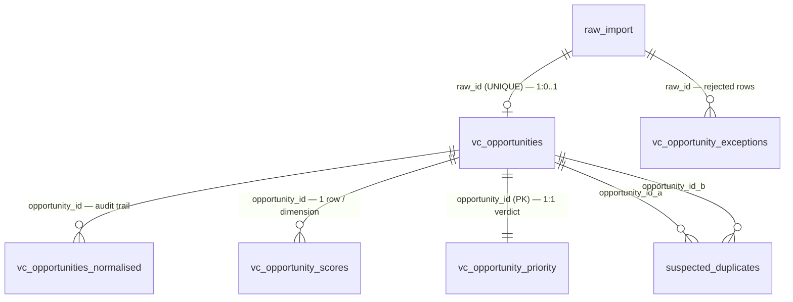
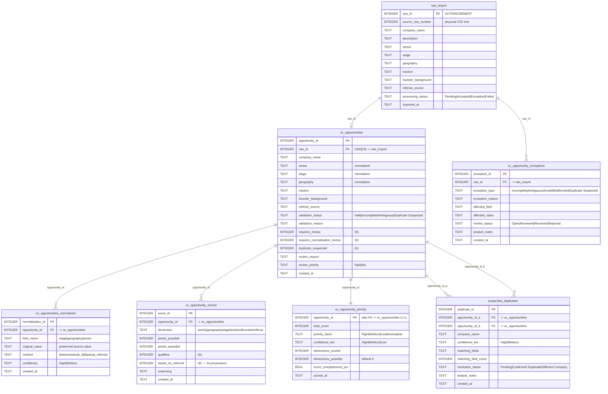

# VC Pipeline — Database ER Diagram

Entity-relationship view of the SQLite schema defined in [`src/db_setup.py`](../src/db_setup.py)
(`CREATE_TABLES_SQL`). Relationships and key columns reflect the live database
(`vc_pipeline.db`). Row counts are from the current build.

> `PRAGMA foreign_keys = ON` is set on every connection
> (`get_database_connection`), so these relationships are enforced, not just documented.

---

## 1. Relationships overview



**Reading the crow's-feet:**

| Pair | Cardinality | Meaning |
|------|-------------|---------|
| `raw_import` → `vc_opportunities` | 1 : 0-or-1 | each staged row becomes **at most one** opportunity (`raw_id` is `UNIQUE`); rejected rows become none |
| `raw_import` → `vc_opportunity_exceptions` | 1 : many | a rejected/empty row is logged as one (or more) exceptions |
| `vc_opportunities` → `vc_opportunities_normalised` | 1 : many | one audit row per field transformed |
| `vc_opportunities` → `vc_opportunity_scores` | 1 : many | one row per scored dimension (NULL fields excluded) |
| `vc_opportunities` → `vc_opportunity_priority` | 1 : 1 | exactly one ranked recommendation (`opportunity_id` is the PK) |
| `vc_opportunities` → `suspected_duplicates` | 1 : many | a record can appear in many flagged pairs (as side A or side B) |

---

## 2. Full schema with columns



---

## 3. Live row counts

| Table | Rows | Grain |
|-------|-----:|-------|
| `raw_import` | 495 | 1 per CSV row (immutable staging) |
| `vc_opportunities` | 480 | 1 per usable record |
| `vc_opportunity_exceptions` | 15 | 1 per rejected row + reason |
| `suspected_duplicates` | 32 | 1 per flagged pair |
| `vc_opportunities_normalised` | 463 | 1 per field transformation |
| `vc_opportunity_scores` | 2,709 | 1 per opportunity **per dimension** |
| `vc_opportunity_priority` | 480 | 1 per opportunity (final verdict) |

Reconciliation: **495 staged = 480 opportunities + 15 exceptions** (nothing lost);
**480 opportunities = 480 priority rows** (1:1).

---

## 4. The trace-back path (lineage in two joins)

Any final recommendation traces back to the original CSV line:


```sql
SELECT r.source_row_number, r.company_name, p.priority_band, p.total_score
FROM vc_opportunity_priority p
JOIN vc_opportunities o ON o.opportunity_id = p.opportunity_id
JOIN raw_import        r ON r.raw_id        = o.raw_id
WHERE p.opportunity_id = 1;
```

**Indexing note (honest):** the only secondary index is the auto-index from
`vc_opportunities.raw_id UNIQUE`; the `opportunity_id` foreign keys on `scores`,
`normalised`, and `exceptions` are unindexed. Irrelevant at 500 rows (full scans are
instant); the first thing to index when scaling to millions, where production storage
would be Dataverse anyway.
```
