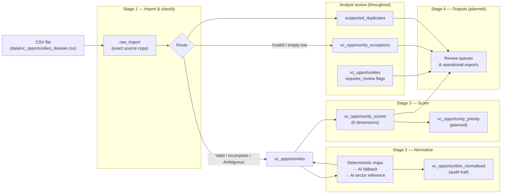
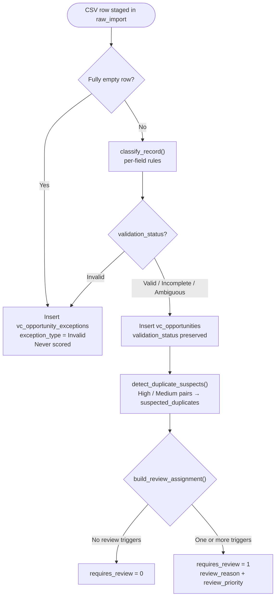
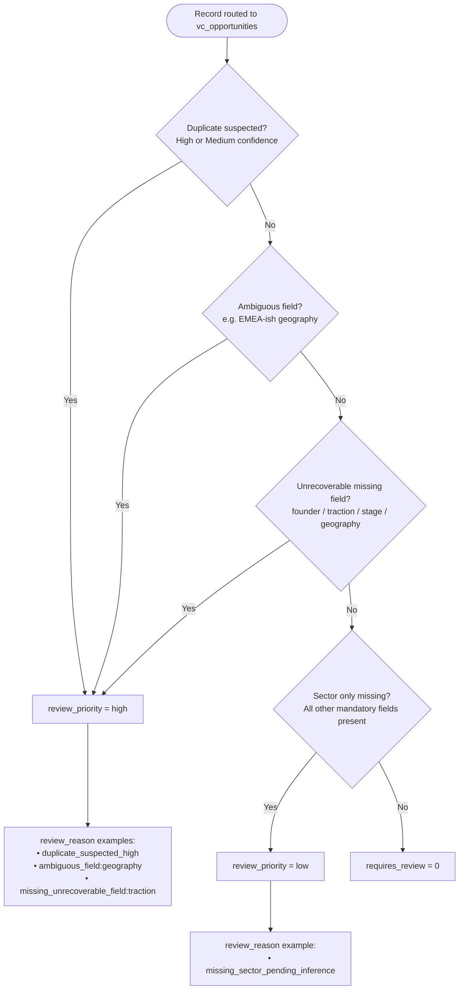
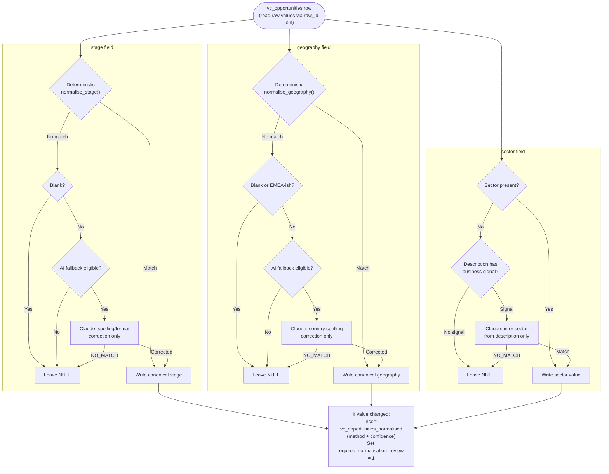
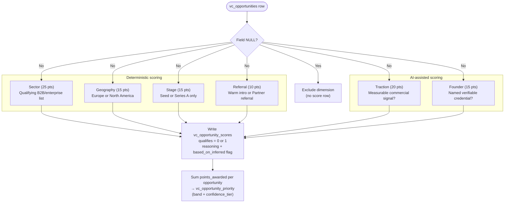
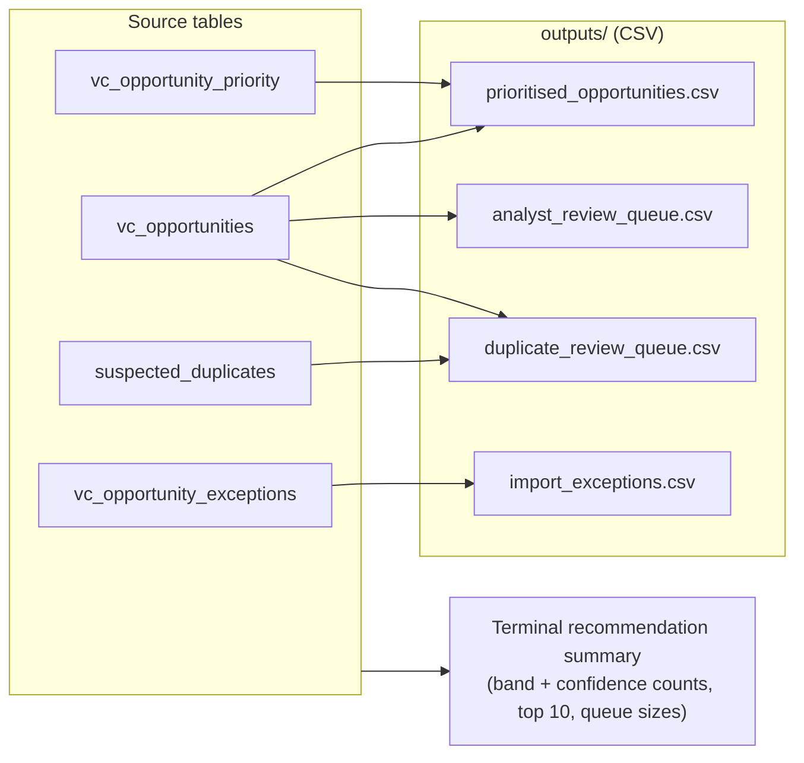
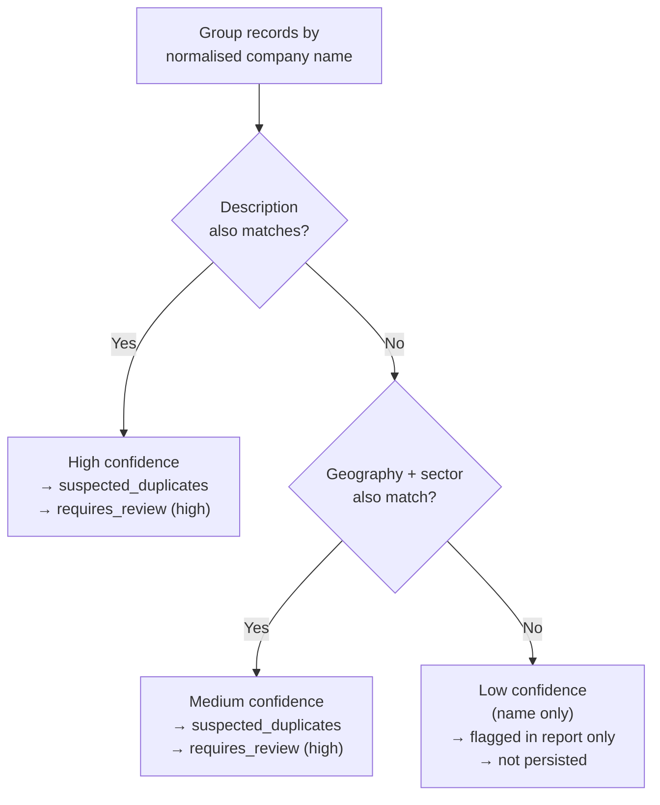

# VC Pipeline — Workflow, Data Flow & Decision Logic

Deliverable artefact for the Copilot Studio Automation Challenge.  
Shows how the prototype handles **import → validation → routing → normalisation → scoring → exceptions → analyst review**.

> GitHub renders Mermaid diagrams in any `.md` file — this document and the README look the same when viewed on GitHub.

---

## 1. End-to-end data flow

High-level view of how a CSV row moves through the pipeline and which tables it lands in.



**Principle:** `raw_import` is never modified after staging. Every downstream decision can be traced back to the original CSV row via `raw_id` and `source_row_number`.

---

## 2. Stage 1 — Import, validation & routing

Each staged row is classified, then routed. Invalid records never enter the scoring pipeline.



### Per-field classification outcomes

| Outcome | Meaning | Example |
|---------|---------|---------|
| **Valid** | Value is present and recognised | `referral_source = Warm intro` |
| **Incomplete** | Mandatory field missing | Blank `traction` |
| **Ambiguous** | Present but not mappable | `geography = EMEA-ish` |
| **Invalid** | Structurally unusable | `geography = Mars`, column contamination |

### Routing rules

| Condition | Destination | Scored? |
|-----------|-------------|---------|
| Fully empty row | `vc_opportunity_exceptions` | No |
| `validation_status = Invalid` | `vc_opportunity_exceptions` | No |
| `Valid`, `Incomplete`, or `Ambiguous` | `vc_opportunities` | Yes (if structurally usable) |

---

## 3. Analyst review — decision tree

Review flags are set at Stage 1 routing. They do **not** block scoring — they queue the record for human attention alongside its score.



**Separate review queues (not auto-resolved):**

| Queue | Table | Trigger |
|-------|-------|---------|
| Exceptions | `vc_opportunity_exceptions` | Invalid or empty rows |
| Duplicate pairs | `suspected_duplicates` | High/Medium confidence name matches |
| Opportunity flags | `vc_opportunities.requires_review` | Ambiguous, missing, or duplicate flags |
| Normalisation audit | `vc_opportunities_normalised` + `requires_normalisation_review` | Any AI or rule-based transformation |

---

## 4. Stage 2 — Normalisation flow

Stage and geography use deterministic rules first; AI is a fallback only. Sector uses AI inference only when missing.



**Deterministic vs AI:**

| Step | Type | When used |
|------|------|-----------|
| Lookup maps | Deterministic | Known values (e.g. `uk` → `United Kingdom`, `seed` → `Seed`) |
| AI fallback | AI (Medium confidence) | Stage/geography typo correction into known categories only |
| AI inference | AI (High/Medium/Low) | Missing sector only, after description signal check |

---

## 5. Stage 3 — Scoring logic

Each dimension is boolean: full points or zero. NULL fields are **excluded** (no row written for that dimension).



### Scoring matrix

| Dimension | Points | Qualifies when | Method |
|-----------|--------|----------------|--------|
| Sector | 25 | B2B SaaS, Enterprise AI, FinTech SaaS, HealthTech B2B, Supply Chain SaaS, Developer Tools, Cybersecurity, LegalTech, HR Tech | Deterministic |
| Geography | 15 | United Kingdom, France, Germany, Spain, Netherlands, United States, Canada | Deterministic |
| Stage | 15 | Seed or Series A (exact) | Deterministic |
| Traction | 20 | Revenue figure, customer count, pilot count, or named metric (e.g. Growing ARR) | AI |
| Founder | 15 | Named company or institution (e.g. Ex-Stripe, Cambridge) | AI |
| Referral | 10 | Warm intro or Partner referral | Deterministic |

### Priority bands

Each opportunity's awarded points are summed into a single recommendation in `vc_opportunity_priority`.

| Total score | Priority band |
|-------------|---------------|
| 75+ | High |
| 50–74 | Medium |
| Below 50 | Low |
| Missing a mandatory field (`sector`, `geography`, or `stage`) | Incomplete |

**Mandatory fields:** an opportunity is marked **Incomplete** (not scored into a band) if `sector`, `geography`, or `stage` is missing after normalisation — these are the structural thesis fields, and without them the deal can't be fairly assessed. Strength signals (traction, founder, referral) simply score 0 when absent rather than forcing Incomplete.

### Confidence tier

Alongside the band, each priority row carries a `confidence_tier` that rates how much to trust the recommendation:

| Tier | Meaning |
|------|---------|
| High | Fully deterministic, clean data — no review flags |
| Medium | A value was AI-corrected during normalisation, but no review is outstanding |
| Low | Flagged for analyst review (missing/ambiguous data, suspected duplicate, or sector pending inference) — recommendation is provisional |

---

## 6. Scoring pseudo-code

Condensed logic as implemented in `stage3_score.py` and `validators.py`.

```
FOR EACH row IN raw_import:

  # --- Stage 1 ---
  IF row is fully empty:
      INSERT vc_opportunity_exceptions (type=Invalid)
      CONTINUE

  status = classify_record(row)   # per-field: Valid | Incomplete | Ambiguous | Invalid

  IF status == Invalid:
      INSERT vc_opportunity_exceptions (type=Invalid, reason, affected_field)
      CONTINUE

  INSERT vc_opportunities (status, review flags from build_review_assignment())
  IF duplicate pair High/Medium: INSERT suspected_duplicates


FOR EACH opportunity IN vc_opportunities:

  # --- Stage 2 ---
  FOR field IN (stage, geography, sector):
      value = resolve(field)          # deterministic → AI fallback → AI inference
      IF value changed from raw:
          INSERT vc_opportunities_normalised (original, method, confidence)
          SET requires_normalisation_review = 1
      UPDATE vc_opportunities.field = value


FOR EACH opportunity IN vc_opportunities:

  # --- Stage 3 ---
  FOR dimension IN (sector, geography, stage, traction, founder, referral):
      IF opportunity.field IS NULL:
          SKIP dimension                    # excluded, not penalised
      ELSE IF dimension qualifies:
          INSERT vc_opportunity_scores (points_awarded = points_possible, qualifies = 1)
      ELSE:
          INSERT vc_opportunity_scores (points_awarded = 0, qualifies = 0)

  # --- Stage 3: priority aggregation ---
  total = SUM(points_awarded)
  band  = priority_band(total, mandatory_fields_present)   # High/Medium/Low/Incomplete
  conf  = confidence_tier(requires_review, requires_normalisation_review)
  INSERT vc_opportunity_priority (total, band, conf, dimensions_scored, completeness)


# --- Stage 4: operational outputs (read-only) ---
EXPORT prioritised_opportunities.csv   # ranked by band then score
EXPORT analyst_review_queue.csv        # requires_review = 1, ordered by priority
EXPORT duplicate_review_queue.csv      # suspected_duplicates joined to both companies
EXPORT import_exceptions.csv           # rejected rows + reasons
PRINT  recommendation summary          # band/confidence counts, top 10, queue sizes
```

---

## 6b. Stage 4 — operational outputs

Stage 4 is read-only. It turns the scored data into analyst-ready artefacts. No new tables — outputs are derived views written as CSVs (open directly in Excel / Sheets) plus a terminal summary.



| Output | Who uses it | Answers |
|--------|-------------|---------|
| `prioritised_opportunities.csv` | Investment team | "What should we look at first?" |
| `analyst_review_queue.csv` | Data analyst | "What needs human attention before it can be trusted?" |
| `duplicate_review_queue.csv` | Data analyst | "Which records might be the same company?" |
| `import_exceptions.csv` | Data analyst | "What was rejected at import and why?" |

---

## 7. Duplicate detection tiers

Duplicates are flagged for review — never auto-merged or deleted.



---

## 8. What is deterministic vs AI?

| Decision | Type | Rationale |
|----------|------|-----------|
| Field validation & routing | Deterministic | Auditable, explainable rules |
| Stage / geography normalisation | Deterministic lookup | Fixed mappings, no guessing |
| Stage / geography typo correction | AI fallback | Only when lookup fails; corrects into known categories |
| Missing sector inference | AI inference | No deterministic source; flagged with confidence |
| Sector / geography / stage / referral scoring | Deterministic | Predictable, auditable matrix |
| Traction / founder scoring | AI-assisted | Requires judgement on free-text; `based_on_inferred = 1` |
| Priority band assignment | Deterministic (planned) | Sum of boolean dimension scores |

**Principle:** AI is used only where rules cannot decide. Every AI-derived value carries a confidence rating and an audit row — it never silently enters the pipeline as fact.

---

## 9. Implementation status

| Component | Status |
|-----------|--------|
| CSV import → `raw_import` | Done |
| Validation & classification | Done |
| Routing → opportunities / exceptions | Done |
| Duplicate detection & `suspected_duplicates` | Done |
| Analyst review flags | Done |
| Stage 2 normalisation + audit trail | Done |
| Stage 3 dimension scoring (6 dimensions) | Done (terminal by default; `--write` to persist) |
| Priority band + confidence → `vc_opportunity_priority` | Done (written with `--write`) |
| Stage 4 operational outputs / review queues | Done (CSV exports + summary) |
